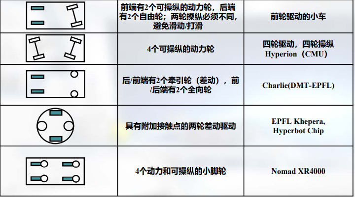
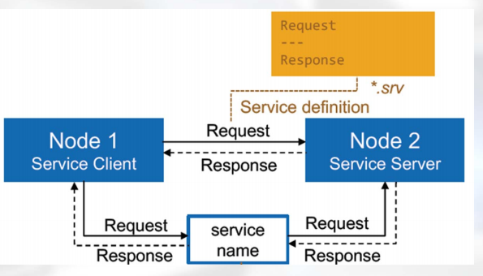
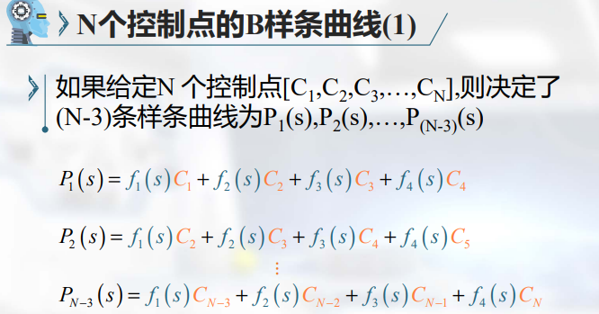
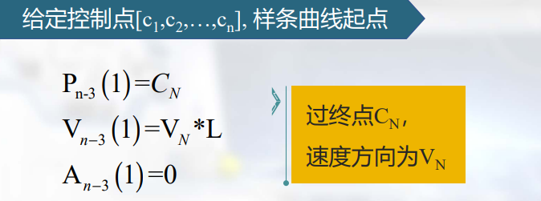
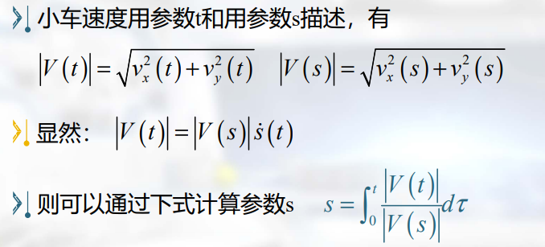
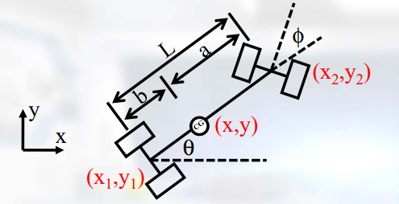
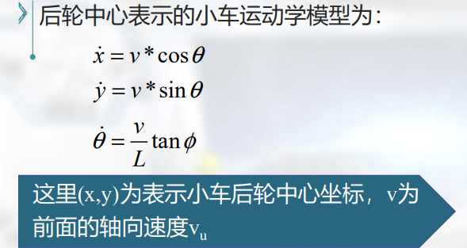
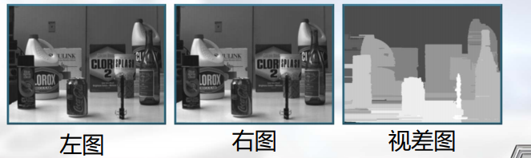
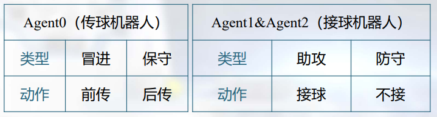
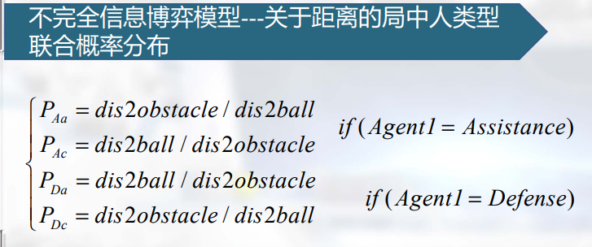

# 智能机器人提纲

编辑时间：2021.6.6

编辑者：萌毛玉

------

[TOC]

## 第一章概述

### 1.1机器人的定义

- 机器人是一个可计算机编程的机器，能够自动地执行一系列复杂的动作。
- 机器人可通过外部控制设备或者内嵌的控制系统导引。
- 机器人可能按照人类的模样构建，但是大多数机器人是设计来执行特定任务的机器，而不考虑其模样。

### 1.2机器人的示例

- 机器人可以是自主的、半自主的、遥控的。机器人包括类人机器人、工业机器人、服务机器人、医疗机器人、娱乐机器人、康复机器人、群体机器人、无人机、无人车、无人艇、微纳米机器人

### 1.3阿西莫夫-机器人三法则

- 机器人不能伤害人类，或坐视人类受到伤害而袖手旁观
- 除非违背第一法则，机器人必须服从人类的命令
- 在不违背第一和第二法则前提下，机器人必须保护自己

阿西莫夫提出的“机器人三原则”为机器人规定了伦理性纲领，一直是机器人科学家研究开发工作的准则。阿西莫夫提出的“机器人三原则”为机器人规定了伦理性纲领，一直是机器人科学家研究开发工作的准则。

### 1.4智能机器人的定义

- 智能机器人是一种自动化的机器，所不同的是这种机器具备一些与人或生物相似的智能能力。
- 智能机器人是具有感知能力、规划能力、动作能力和协同能力的一种高度灵活的自动化机器。
- 智能机器人是一种可被编程，根据传感器输入以执行动作或者作出选择的智能机器。

尚无统一的定义

1956年，马文ꞏ明斯基提出了他对智能机器的理解：“智能机器能够创建周围环境的抽象模型，一旦遇到问题，便能够从抽象模型中寻找解决方法”

### 1.5智能在机器人上的体现

- 自主性：是指其可以在特定的环境中，不依赖任何外部控制，无需人为干预，完全自主地执行特定的任务

- 适应性：是指它可以实时识别和测量周围的物体，根据环境的变化调节自身的参数，调整动作策略，以及处理紧急情况
- 交互性：是指机器人可以与人、外部环境及与其他机器人之间进行信息交流
- 学习性：是指机器人在自主感知环境变化的基础上，可以形成和进化出新的活动规则，自主独立地活动和处理问题。
- 协同性：是指在实时交互的基础上，机器人可以依据需求和任务实现机机协作和人机协同。

### 1.6智能机器人典型案例

- 足球机器人：机械结构设计、运动控制、实时图像处理、机器人结构体系结构、机器人视觉、路径与轨迹规划、机器人自定位、多机器人协调控制、目标识别与跟踪
- 救援机器人：在复杂模拟灾后环境中，基于激光雷达等建立环境地图，实现高精度的SLAM；使用红外热像仪、可见光相机等识别模拟受困者，并标注在环境地图上；自主地规划未来的环境探索目标点，自主地遍历环境中的所有区域；

------

## 第二章智能机器人平台与系统

### 2.1智能机器人的运动结构

- 智能机器人需要运动机构，使机器人在环境中无约束地运动，运动机构很大程度上决定着智能机器人的运动性能
- 常见的地面移动机器人行走结构：轮式行走机构、履带式行走机构、腿式行走机构、复合式行走机构

### 2.2轮式行走机构

- 轮式运动的优点：相比较腿式和履带式，轮式驱动机器人运动更快，消耗的能量较少；从控制的角度，由于其简单的机械结构和较好的稳定性，相对较为容易控制。
- 轮式运动的缺点：在粗糙地形环境、不平整的地面应用起来较为困难。
- 轮式运动关注牵引、稳定性、机动性等问题：轮子能否提供足够的牵引力和稳定性？能否对机器人的速度进行充分的控制？

### 2.3差动运动轮式行走机构

- 差动运动方式，在平面内是一种非完整约束。差动运动轮系是由两个轴线平行的驱动轮以及一个或多个从动轮组成。通过控制两个驱动轮达到一定的速度，就可得到差动运动的效果。
- 当两驱动轮具有相同的速度时，就能使得机器人进行直线运动。
- 当一个驱动轮的速度为零，另一个驱动轮速度不为零时，机器人就会绕前一驱动轮与地面的接触点作旋转运动。
- 当两驱动轮速度出现其他情况时，机器人的运动将会是这以上两种运动的合成。
- 差动运动的方式非常普遍，它的各种衍生形式如：中心可转向轮、阿卡曼等

### 2.4全向运动轮式行走机构

- 理论上单个球形轮可实现全向运动
- 球形轮轮体为球形，通过控制分布在轮体周围的摩擦轮，实现球轮的驱动。结构和控制非常复杂，技术上实现困难，而且应用范围有限，只能在环境比较理想的条件下（如地面平整）使用。
- 多个全向轮组合使用
- 全向运动平台最常见的为三轮或四轮构型

### 2.5腿式行走机构

- 在平坦的表面，轮式运动比腿式运动效率高1-2个数量级
- 轮式运动效率依赖于周围环境的质量，尤其是地面的平整度和硬度
- 自然界偏爱腿式运动，因为自然界运动系统必须在粗糙和非结构化地形运行
- 腿式运动的主要缺点包括动力和机械的复杂性，腿的数量会影响机械的复杂性和控制的复杂性
- 昆虫一出生就能行走，4条腿哺乳动物出生后几分钟能行走，2条腿的人需要一年才能行走
- 腿式移动机器人的腿至少需要2个自由度，提腿和将腿摆动向前。
- 增加腿的自由度可提高机器人的机动性，但是需要增加关节和激励器，会带来动力、控制和质量方面的问题，需要更多的能量和控制
- 为提高腿式移动机器人的效率，可更好地挖掘机械结构的潜力
- 如摆和弹簧的自然振荡可以自动产生周期性运动，可用于构建没有任何类型激励的腿式机器人

### 2.6履带式行走结构

- 连接到驱动齿轮、轮子或链轮的一组连杆，允许它们沿着机器人的底盘以与传送带类似的方式运行
- 优点：可提供更大的牵引力，更大的加速度；可以提供比轮子更好的平衡；具有更强的越障能力。
- 缺点：履带可能脱落、卡住甚至撕裂；履带和驱动机构之间的间隙可能被卡住；修理相对更难；运动速度相比较轮式运动更低
- 一般再增加单独控制或者联动控制的2个或者4个鳍，提高机器人通过复杂地形的能力

### 2.7复合式行走结构

- 轮式、腿式、履带式行走机构各有其优缺点
- 采用复合式行走机构提高机器人运行性能
- 轮腿式行走机构

### 2.8智能机器人机械结构设计的一般步骤

- 需求分析：任务分析和环境分析，确定主要性能指标和设计参数
- 确定工作原理和结构类型，绘制原理图或机构运动简图
- 受力分析，运动学和动力学分析，计算其运动参数和动力参数
- 确定动力源和传动方式
- 3D建模，完成结构设计和材料选择
- 特性分析，包括应力、强度、刚度、抗磨性、耐热性、振动稳定性、惯性参数等
- 绘制出总装配图、部件装配图以及零件工作图等工程图纸，并审核
- 加工、安装、调试、迭代改进

### 2.9智能机器人的驱动方式

- 智能机器人的驱动系统主要是指驱动机械系统动作的驱动装置。
- 根据驱动源的不同，驱动系统可分为电气、液压和气压三种以及把它们结合起来应用的综合系统。该部分的作用相当于人的肌肉。
- 电气驱动应用得最为普遍，主要是电机驱动，优点是控制精度高。机器人电动伺服驱动系统是利用各种电动机产生的力矩和力，直接或间接地驱动机器人本体以获得机器人的各种运动的执行机构。
- 舵机是一种位置（角度）伺服的驱动装置，适用于需要角度不断变化并可以保持的控制系统。通过内部换向、固定磁铁（永久磁铁或电磁铁）和旋转电磁铁，直接从提供给电机的直流电产生扭矩。机械换向，磁极不动，线圈旋转。
- 有刷直流电机的优点是低成本、高可靠性和电机速度控制简单。缺点是高强度使用时的维护需求高和低寿命。采取电子换向，线圈不动，磁极旋转。使用一套电子设备，通过霍尔元件，感知永磁体磁极的位置，根据这种感知，使用电子线路，适时切换线圈中电流的方向，保证产生正确方向的磁力，来驱动电机。无刷电机优于有刷电机的优点是高功率重量比，高速和电子控制，无电刷、低干扰、寿命长
- 步进电机：将电脉冲信息转变为角位移或者线位移的开环控制电机，电机的转速、停止位置取决于脉冲信号的频率和脉冲数。收到一个脉冲信号即按设定方向转动一个固定的角度。转动速度和脉冲的频率成正比。优点可靠性较高、开环控制，缺点难以获得高转速和大转矩

- 液压驱动系统运动平稳，且负载能力大。优点是驱动力或驱动力矩大,即功率重量比大，响应快速，易于实现直接驱动。缺点是需配备压力源及复杂的管路系统,因而成本较高；油液容易泄漏,影响工作的稳定性与定位精度
- 气压驱动机器人结构简单、动作迅速、价格低廉，但由于空气具有可压缩性，其工作速度的稳定性较差。通常由压缩空气或压缩惰性气体提供动力。电动压缩机为气缸，气动马达和其他气动装置提供动力。通过自动电磁阀控制，优点是速度快、系统结构简单，维修方便、价格低，缺点是难以实现伺服控制

### 2.10机器人操作系统(ROS)

- Robot Operating System：开源的元操作系统，提供类似传统操作系统的诸多功能

- 提供相关工具，用于获取、编译、编辑代码及在多个计算机之间运行程序完成分布式计算。
- 提供环境感知、运动控制、路径规划等研究领域经典的和前沿的算法代码库，提高机器人软件代码复用率，缩短软件开发周期。
- 

### 2.11ROS计算图

- ROS底层提供点对点（P2P）网络的通信架构
- 实现模块间松耦合网络连接和协同计算
- 功能模块可以位于同一台或者不同计算机
- 构成的点对点网络称为ROS计算图

- 概念：

  1. 主节点/节点管理器（Master）：提供域名注册和查找的功能，类似网络通信中的域名服务器。
  2. 节点：ROS以模块化的形式组织计算资源，节点是用于执行计算任务的进程
  3. 主题/话题（topics）：ROS提供一种基于发布/订阅机制的通信形式，节点通过发布和订阅相关话题来通信。
  4. 消息（messages）：节点之间通过消息进行通信，其实是话题的数据结构
  5. 服务（services）：分布式系统某些任务有握手的要求，服务即通过请求/应答机制满足这个需求，称为服务调用。
  6. 参数服务器(parameter server)：实现参数集中存储，节点查询其参数的值。是Master的一部分。
  7. 数据记录包(bags)：记录和重现ROS数据，选择性录制，高保真回放，数据共享

  

  

  

### 2.12工具

- rqt_bag：数据记录与重现
- rqt_graph：查看节点及其间关系
- rqt_plot：实时绘制曲线
- 运行ROS系统roslaunch，rosrun，roscore
- 系统交互与调试rostopic、rosservice、rosnode、rosparam、rosmsg…
- 安装、编辑和文件系统工具rosmake、rosinstall、rospack、roscd

------

## 第三章机器人运动与控制

### 3.1控制系统设计流程

### 3.2移动机器人构型

- Car-Like小车，由直流电机通过减速齿轮带动后轮旋转驱动小车以速度V前进；由舵机驱动前轮转向，转向角为φ
- 两个直流电机分别通过减速齿轮带动左右轮旋转，左轮前向速度为VL，右轮前向速度为VR。

### 3.3移动机器人平面曲线规划

- 规划一条由起点到终点，合乎要求光滑曲线。给定一组控制点而得到一条曲线，曲线大致形状由这些点予以控制。一般用得多是三次B样条曲线

### 3.4B样条曲线

### 3.5B样条曲线速度与加速度

### 3.6B样条曲线光滑性

### 3.7过起点的B样条曲线

- V1表示小车过C1速度方向的单位向量
- L为合适正常数，可以取为小车车长一半

### 3.8过终点的B样条曲线

- 如果给定控制点[C1,C2,…,CN],如何保证P(s)过终点CN？
  - VN表示小车过CN速度方向的单位向量、
  - VN表示小车过CN速度方向的单位向量

### 3.9过起点和终点的B样条曲线

### 3.10过任意控制点的B样条曲线

### 3.11轨迹曲线的曲率

### 3.12小车移库问题demomooc5.m

- 前面小车平面轨迹我们都是用参数s计算的。但小车平面轨迹用时间参数t描述，更符合习惯

### 3.13Car-Like小车运动学模型

- 基于小车几何结构参数，分析推理出小车独特的运动特性——运动学(Kinematics)方程
- 定义后轮中心到前轮中心的轴线为小车中轴线，其与x轴的夹角为θ(方位角)，这里假设重心CG在中轴线上；小车前轮方向与小车中轴线的夹角为φ(转向角)。

- a为重心到前轮中心距离，b为重心到后轮中心距离，L为前轮中心与后轮中心的距离，显然L=a+b

- 设小车重心坐标为(x,y)，则后轮中心坐标为(x1,y1)，前轮中心坐标为(x2,y2)

### 3.14Car_Like小车转向曲率

### 3.15Tank-Like小车运动学模型

### 3.16Car-Like小车动力学

- 利用赛道宽度，尽量减少小车轨迹曲线曲率，即减小转向角，有利于小车加速

### 3.17双轮差速驱动小车动力学

### 3.18曲线跟踪算法

### 3.19Car-Like小车曲线跟踪算法

### 3.20Car-Like小车曲线跟踪控制器设计

### 3.20Tank-Like小车曲线跟踪算法

### 3.21移动机器人平面曲线规划

------

## 第四章机器人传感器

### 4.1传感器的作用和地位

- 机器人传感器一般用于感知自身状态如速度、加速度、姿态等，周围环境如亮度、颜色、距离等
- 是机器人智能化的基础和执行各种任务的前提
- 随着各种传感器的应用，机器人的智能化程度不断提高
- 与生物的感知能力互有千秋
- 视觉系统已成为了各种自主移动机器人最重要的环境感知手段，能够提供丰富的环境感知信息。

### 4.2传感器分类

### 4.3旋转角测量

- 增量式光电编码器
  - 光电编码器主要由光栅转盘、光源、感光器件和信号处理电路构成
  - 将机械转动角度转换为正弦波或方波电信号
  - 正弦波或方波的数量正比于旋转的角度
  - 光栅的数量决定了对于转动角度测量的精度
- 霍尔效应编码器
  - 霍尔效应编码器又简称霍尔编码器/磁编码器，是根据霍尔效应制作的一种换能器，将磁场的转动转化为输出电压的变化。
  - 为提高精度，在芯片中布局多个霍尔效应器
  - 磁感线以相反方向穿越两两对称的霍尔效应器
  - 正弦波电信号的组合用于确定旋转的角度
  - 14位分辨率（360度/4096线）
  - 可以测量绝对位置

### 4.4惯性器件

- 加速度计
  - 
  - 要想获得机器人的速度和位置，需要对加速度进行积分和二次积分，因此，加速度误差会随积分而放大。
  - 在地球表面，加速度计在竖直方向一直受到重力的作用。为了获得实际的惯性加速度（仅与运动相关），需要将重力剔除，如果没有剔除重力作用，物体自由落体时加速度计的输出将为0
  - 单个加速度计只能测量一个轴向的加速度，将三个加速度计正交安装，可以获得一个三轴加速度计
- 陀螺仪
  - 由一个位于轴心且可旋转的转子、万向节、支架等构成，一旦开始旋转，由于转子的角动量，陀螺仪有抗拒方向改变的趋向。
  - 要想获得角度（姿态角）需要进行积分，因此测量误差会随着积分而放大。
- 惯性测量单元
  - 惯性测量单元（Inertial Measurement Unit）是测量物体三轴姿态角(或角速率)以及加速度的装置
  - 一般的，一个IMU包含了三个单轴的加速度计和三个单轴的陀螺
  - IMU的数据输出频率较高，能够有效反映机器人等运动载体的瞬时运动
  - 由于存在累积误差，IMU的漂移不可避免，可通过GPS、视觉、激光雷达等传感器校正

### 4.5飞行时间测距

- 超声波传感器和ToF激光雷达利用测量声波或光波的飞行时间来计算与目标之间的距离
- 
- 超声波原理：利用压电晶片等超声波换能器发射超声波，经被测物体的反射，回波通过压电等超声换能器接收，发射和接收超声波的时差用来计算被测距离。
- 超声波是振动频率高于20kHz的机械波，具有频率高、波长短、绕射现象小，特别是方向性好、能够定向传播等特点，几乎不受光线、粉尘、烟雾、电磁干扰等影响
- 典型频率：40kHz-180kHz，典型频率：40kHz-180kHz，一般利用压电晶片发射和接收超声波，发射器和接收器可以集成为一体或者分开分辨率为2cm左右测量误差一般为2%
- 超声波沿锥体传播，波束角一般为20°~40°，实际获得某区域的深度值
- 应用：实际获得某区域的深度值
- ToF激光雷达又叫激光扫描仪、激光测距仪，主动发射600~1000纳米红外线激光脉冲，接收经目标反射的脉冲，测量飞行时间，结合光速计算距离，激光聚焦能力强，短距离内基本不发散，光速不易受温湿度等环境变化影响

### 4.6相机

- 是构成各种机器人视觉系统的核心传感器，其成像原理借鉴了眼球成像，将光信号转换为数字（或模拟）图像
- 视觉感知模态的优势：信息丰富、兼容性好、成本低廉
- 针孔相机的问题
  - 针孔尺寸很小才能清晰成像
  - 针孔尺寸越小，到达像平面的光线越少
  - 如果针孔的尺寸与光的波长相当，衍射作用将使成像模糊
  - 容易形成暗角
- 镜头的作用
  - 镜头将光线聚焦于像平面（胶片、CCD、CMOS）
  - 穿过光学中心的光线不会改变方向，穿过光学中心的光线不会改变方向

### 4.7成像模型

- 当𝑧远大于𝑓时，可以忽略像平面与焦点的距离
- 在物距远大于焦距时，可以近似为针孔成像，在此近似模型下，物体成像大小与相机距离成反比，这种依赖关系叫做透视。

### 4.8透视投影：从世界坐标系到像素坐标系

- 为便于推导，一般将像平面置于相机与前面，此时图像与目标的朝向相同
- 世界坐标系W-XW-YW-ZW：三维世界绝对坐标系，用于描述相机和其它物体的位置。
- 图像坐标系𝑂−𝑋𝑌：以像平面中心为坐标原点，X轴和Y轴分别平行于图像的两条边

- 相机坐标系C-XC-YC-ZC：以相机的光心为坐标原点，X轴和Y轴分别平行于图像坐标系的X轴和Y轴，相机的光轴为Z轴。

- 像素坐标系u-v：以像平面的左上角顶点为原点，X轴和Y轴分别平行于图像坐标系的X轴和Y轴，以像素为单位。
- 找到世界坐标系中的点Pw经透视投影后在像素坐标系中的坐标(u,v)
  1. 将这个点从世界坐标系Pw转到相机坐标系Pc
  2. 将Pc投影至图像坐标系(x,y)
  3. 将(x,y)变换到（离散）像素坐标系(u,v)

### 4.9从相机坐标系到图像坐标系

### 4.10从相机坐标系到像素坐标系

### 4.11从世界坐标系到相机坐标系

### 4.12镜头径向畸变

- 由于制造加工的原因，镜头一般都存在着某种程度的非线性畸变
- 前面推导的透视投影模型并没有考虑镜头的畸变
- 添加非线性的畸变项进行修正，能够得到成像过程更准确的数学模型、
- 张正友标定方法、Matlab工具箱

### 4.13立体相机

- 理想化：两个相机成像模型完全一致
- 简单化：两个相机只在x轴方向存在偏移
- 利用两个或更多相机，从不同角度成像，则可以恢复出三维场景信息

- 视差图由所有像素的视差值构成：在两幅原图中确定所有像素的对应关系计算每个像素对的视差

- 两个完全一致的相机不存在，将两个相机在水平轴上对齐非常困难

### 4.14图像区域匹配搜索：对极几何约束

- 极点：右相机坐标原点在左像平面上的像；左相机坐标原点在右像平面上的像
- 极平面：由两个相机坐标原点、和物点P组成的平面
- 极线：极平面与两个像平面的交线
- 级线约束：两极线上点的对应关系

------

## 第五章机器人自主定位与建图

### 5.1移动机器人自主导航的三个基本问题

- 我在哪里
- 我要去哪里
- 我怎样到达那里

本章关注如何在未知环境中如何全面地回答“我在哪里”的问题？

- 定位+地图构建（建图）
- 矛盾：根据地图实现定位、基于定位构建地图
- 同步定位与建图(simultaneous localization and mapping,SLAM)

### 5.2机器人的定位如何表示

- 在全局坐标系中表示:如以大地经度、大地纬度和大地高度表示地面点位置的大地坐标系
- 在局部坐标系中表示:如三维笛卡尔坐标系•三维位置x,y,z•可用旋转矩阵R表示姿态

### 5.3利用外部信号的定位方法

- 全球导航定位系统（GNSS）:GPS、北斗
- 局部坐标系中定位:超宽带（UWB）定位系统刚体运动捕捉系统

### 5.4SLAM

- 利用自身传感器的自主定位SLAM方法仅利用自身传感器实现定位与建图，以支持路径规划等任务
- 定位和建图同时进行,利用闭环信息修正累积误差

### 5.5视觉SLAM

- 传统视觉建图方法举例：structure from motion(SFM)
- 基于视觉实现环境三维建图的经典方法，要求实时性，对相机连续的运动进行估计
- 优势：信息量与可扩展性、应用范围
- 

### 5.6SLAM的闭环检测与全局优化

- 基于视觉的闭环检测：特征词袋（BOW）方法、生物启发式方法、深度学习方法
- 基于闭环检测结果的SLAM地图全局优化：利用闭环约束最小化位姿图的全局误差

### 5.7传统视觉SLAM与其他方法的结合

- 多传感器融合：视觉+laser+IMU
- 地图数据管理：针对大范围环境中工作利用数据库技术
- 结合深度神经网络方法：语义SLAM、非传统SLAM架构

### 5.8SLAM中地图的表示方法

- 稀疏特征点地图：一般使用特征点地图，具有三维坐标的稀疏的局部视觉特征
- 稠密点云地图：三维激光雷达可获得激光点云
- 占有栅格地图（occupancy grid map）（二维栅格地图、三维栅格地图）

### 5.9占有栅格地图

- 前述两种地图一般不能直接用于路径规划，与路径规划方法相关：需要对空间中障碍物情况进行描述
- 将空间进行栅格化划分，描述各栅格是否被占有的属性
- 二维栅格地图：根据概率值确定属性：占有、空闲、未知，不断更新概率值
- 三维栅格地图：

------

## 第六章多机器人协同控制

### 6.1多机器人系统的背景起源

- 在自然界的众多生物群体中,如蚂蚁、蜜蜂、鸟群、鱼群等,不存在一个协调者来协调大量自主的个体,但整个系统却呈现协调、有序的状态。

### 6.2多机器人系统的概念

- 机器人的应用越来越多，那么如何高效地组织、管理以及应用这些机器人成为难题
- 某些复杂的作业由单一机器人又难以完成,需要多机器人相互协调与合作共同完成
- 多机器人系统不是单个机器人作用的线性求和，多机器人拥有在时间、空间、功能、信息及资源上的分布性，从而实现1+1+1+…>N的效用

### 6.3多机器人系统的社会行为特征

- 群体大小：是指机器人数量规模,有限群,还是无限群。
- 积极或非积极合作：即有意识的合作还是无意识的合作。
- 独立级别：是分散式，集中式，还是二者混合式。
- 通讯类型/范围/途径:通信是显式通讯还是隐式通讯.
- 群体组成:群体中成员可以是同类,也可以是异类
- 群体可重构造性:指群体结构的柔韧性，分静态、通讯协调、动态。

### 6.4多机器人系统分类

- 群机器人-SWARM
- 智能多机器人系统-IMRS
- 可重构机器人RMRS

### 6.5多机器人系统的特点及优势

- 多机器人系统特点
  - 资源分布：多机器人系统中各机器人可以具有不同的传感器和执行器
  - 较高的系统可靠性：多个机器人容错性更强，鲁棒性更好

### 6.6多机器人体系架构

- 集中式：通常有一个主控机器人
- 分布式：各机器人之间是平等关系
- 混合式：介于二者之间的混合结构

### 6.7多机器人通信

- “多机器人系统通信”是机器人之间进行交互和组织的基础。通过通信，多机器人系统中各机器人了解其它机器人的意图、目标和动作，以及当前环境状态等信息，进而进行有效地磋商，协作完成各项任务。
- 显式通信
- 隐式通信：多机器人系统间可不直接进行信息交换，而是通过外界环境和自身传感器来获取所需的信息来实现协作。
- 混合通信：由于显式通信和隐式通信各具优势，将两者结合应用，隐式通信用于底层协作而显式通信用于上层协调。

### 6.8多机器人系统协同感知

- 多机器人系统的感知包括感觉和理解两方面：在多机器人系统当中，要实现优化决策,并获得良好的协调控制性能,必须依赖于准确可靠的环境感知能力，且需要将其它机器人的传感信息与自身传感信息进行融合以获得对外部环境的正确理解。

### 6.9多机器人系统协同规划

- 随着多机器人系统应用的场景越来越复杂，机器人之间可能发生资源共享冲突，多机器人的协同规划要在空间、时间以及资源上实现优化配置，确保高效达成任务的同时保证安全无碰撞。

### 6.10多机器人系统协同决策

- 多机器人的协同决策是从系统整体规划上减小冲突概率,减少资源浪费,保证系统的最优性。协作机制可以存在于机器人的控制结构、通信机制和相互作用中,并主要表现为任务分配问题。

### 6.11多机器人系统协同控制

- 多机器人协同控制指的是多个机器人组成的团队在向特定目标或者方向运动的过程中，相互之间保持预定的几何形态（即队形），同时又要适应环境约束（例如避开障碍）的控制问题
- 集群控制、编队控制
- 虚拟结构法、跟随领航者方法、基于行为的方法、基于图论的方法

### 6.12多机器人仿真系统介绍、

### 6.13多机器人系统任务分配

- 给定多机器人系统、任务集合和性能评价指标，为每个子任务寻找合适的机器人执行该任务，且使得机器人系统执行任务集合的全部任务时获得的收益达到最大。
- 如何应对机器人失效的情况；如何减少多机器人协同对通信的依赖性

- 集中式任务分配
  - 优点：实现较简单、算法设计难度较低、对于规模较小的系统易于实现任务的优化分配
  - 缺点：通信集中，容易造成通信堵塞、计算集中，难以实时处理规模较大情况、鲁棒性不高，中央节点失效将导致系统失效、难以对动态性较高的环境作出及时处理、系统的规模增大导致问题的复杂度迅速增加，分配难以在短时间内完成
- 分布式任务分配
  - 更适合于动态环境和任务变化的情况
  - 各个机器人自主决策直接应对环境变化，对动态变化环境能及时处理
  - 无中央节点，机器人之间关系平等，具备克服部分机器人失效的能力
  - 各机器人均具有计算能力，设计合理的任务分配机制，能实时处理大规模的情况
  - 机器人只需与一定范围内的若干机器人通信，不存在通信量极大的中央节点，通信负荷比较均衡

### 6.14RoboCup

- 避免角色冲突、避免角色分配震荡

### 6.15无通信任务分配

- Wi-Fi的普及程度越来越高，比赛网络极易受到干扰：影响机器人足球比赛的正常进行、对裁判和场外观众造成安全威胁
- 拓展到复杂大环境下，根本不具备可靠通信的条件：复杂室外环境或灾害救援现场

- 不完全信息博弈理论：如果参与博弈的局中人持有其他局中人所不知道的私人信息，那么这样的博弈就称为不完全信息博弈，也被称为贝叶斯博弈。

- 决策困境：不同的Agent0类型下，Agent1利用划线法求得的纯策略纳什均衡解不同，这样的不完全信息就导致了Agent1的决策困境，即面对未知的Agent0类型究竟该不该接球。

### 6.16多机器人环航编队

- 环航编队控制的潜在应用场景：巡逻区域、对敌监视和威慑、保护重要成员

### 6.17多机器人固定半径环航编队控制

### 6.18智能人机交互

- 随着移动机器人越来越多地走向实际应用，需要提高机器人与人类之间的协同水平，实现机器人与人类的共融

- 传统的救援机器人遥控存在的问题
  - 操作员在第三视角下的临场感不强
  - 传回的视频流经常会有延时和丢包现象，增加了操作难度，容易使操作员疲劳
  - 利用手柄、键盘等设备为机器人下达运动级指令的方式控制效率低下
- 火星车的遥操作控制
  - 火星车的遥操作控制（超大时延）：地面团队将命令序列发至火星车（如要求火星车往前行驶10米，再向右转），火星车执行命令序列后，将采集的图像等数据传输回地面。地面团队根据上述执行情况规划第二天火星车的命令序列
  - 命令序列需要通过仿真系统验证才能发给火星车。仿真系统包括虚拟火星环境、虚拟智能火星车、轮子-地形相互作用等三个主要模块，可完成实时和高保真度的运动学仿真

- 改进人机交互界面的设计
  - 通过改进人机交互界面的设计来提高遥控操作的效率和机器人系统的性能
  - 系统研究遥控站界面的设计对参加AAAI和Robo Cup救援机器人比赛性能的影响，提出了若干设计准则，如尽可能使用单个显示器、避免在界面中使用小视频窗口、避免窗口发生遮挡、界面设计要考虑潜在使用者而不是开发者等
- 新型人机交互技术
  - 随着语音识别、图像理解、肌电信号提取、脑机接口等的进步，基于语音、动作的人机交互技术逐步走向成熟，基于肌电、脑电等新型人机交互技术开始出现，为人机交互提供了更多的选择
- 基于VR和三维建图的人机交互
  - 人—机器人共融要求人机交互更加自然和智能化，机器智能与人类智能有效结合
  - 基于三维激光雷达建立环境三维地图，使用3D-NDT压缩表示并增量式地传输至虚拟现实系统实时可视化
  - 基于虚拟现实系统人机交互设备控制机器人探索复杂未知环境
  - 可实现动作级和行为级的人机交互
- 三维地图在虚拟现实系统中增量式的实时可视化
  - 虚拟现实中实时可视化三维环境地图，必须采用合适的方式压缩地图数据，同时又不影响地图精度并保留主要信息
  - 3D-NDT将三维点云空间均匀分割为多个NDT单元，计算每个NDT单元内三维点的分布将其拟合为一个有位置和尺度的椭球
  - 该表示方法可以高效地压缩地图数据量，同时可以保留地图的主要信息

